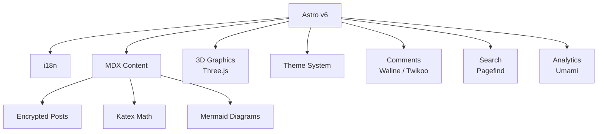

  

       

  <b>Personal blog about tech, embedded systems, robotics, and life</b>

---

## 🌱 Overview

Banu's personal blog built with Astro v6 — featuring i18n, encrypted posts, Three.js 3D graphics, Mermaid diagrams, KaTeX math, Umami analytics, and a full custom remark/rehype plugin pipeline.

---

## 🛠️ Features

- Internationalization (i18n) support
- Encrypted/protected blog posts
- 3D interactive elements (Three.js / React Three Fiber)
- Mermaid diagrams and KaTeX math rendering
- Full-text search via Pagefind
- Waline + Twikoo comment systems
- Umami analytics integration
- Shiki syntax highlighting

---

## 🚀 Tech Stack

       

---

  

