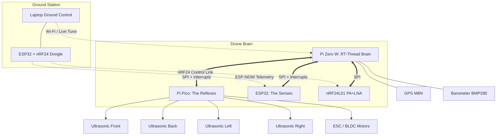
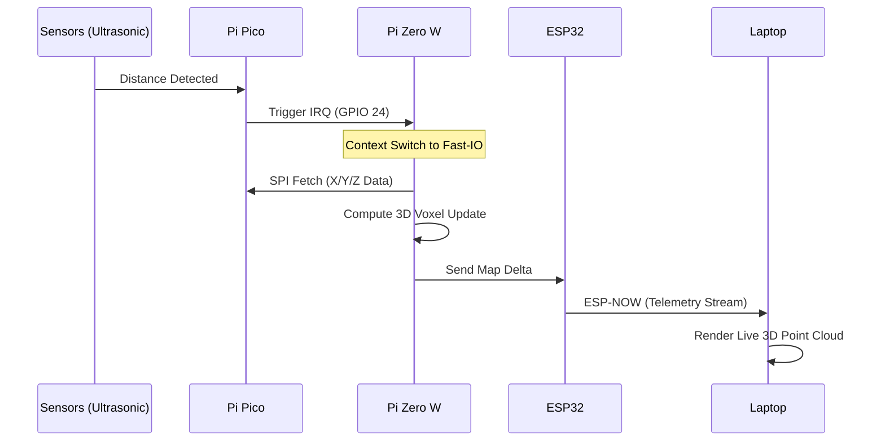
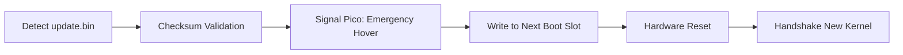
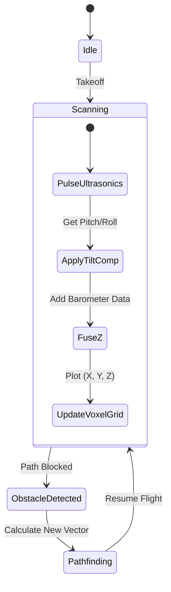

# Building an Autonomous 3D Mapping Drone Brain

In this project, we move beyond basic flight controllers. We are building a **tri-processor "Brain"** for a smart drone. By leveraging a Raspberry Pi Zero W as the high-level decision maker, a Pi Pico for real-time motor reflexes, and an ESP32 for high-bandwidth telemetry, we create a system capable of 3D mapping and autonomous obstacle avoidance.

To maximize the 512MB RAM of the Pi Zero, we have ditched Linux in favor of **RT-Thread RTOS**, enabling hard real-time performance and deterministic scheduling.

## System Architecture

The core of this build is a **Master-Slave SPI architecture**. The Pi Zero W coordinates all data, while sub-processors handle the timing-critical tasks.




## Data Flow & Communication

The fastest and most efficient way to link these boards is via the **SPI Bus**. We utilize **Hardware Interrupts (IRQ)** to ensure the Pi Zero reacts instantly to sensor data without polling.



## Hard Real-Time Mapping Logic (C++)

Because we are mapping a 3D environment, we cannot rely on Python's garbage collector. We use C++ on RT-Thread to manage a **Voxel Chunking** system. Active voxels are kept in a small RAM cache, while the full room map is persisted to the SD card to save memory.

### Voxel Data Structure

```cpp
// Persistent Voxel Chunk Management
struct VoxelChunk {
    uint32_t chunk_id;
    // Each byte represents a 3.2cm cube density
    uint8_t density[32][32][32]; 
};

// Offloading "Cold" Map Data to SD Card using LittleFS
void offload_to_sd(VoxelChunk *chunk) {
    char path[32];
    rt_snprintf(path, sizeof(path), "/map/chunk_%d.bin", chunk->chunk_id);
    
    // Open file using the RT-Thread Device File System (DFS)
    int fd = open(path, O_WRONLY | O_CREAT | O_TRUNC);
    if (fd >= 0) {
        write(fd, chunk->density, sizeof(chunk->density));
        close(fd);
    }
}

```

## A/B Live Firmware Swap

To allow "Pico-style" drag-and-drop updates, the Pi Zero acts as a USB Mass Storage device. When a new `kernel.img` is detected, the drone performs a coordinated handover.

### The Swap Logic Flow



### Firmware Monitor Implementation

```cpp
void firmware_update_loop(void *parameter) {
    while (1) {
        // Look for the file dropped via USB Gadget Mode
        if (check_file_exists("/update.bin")) {
            rt_kprintf("New firmware detected! Signaling Pico...\n");
            
            // 1. Tell Pico to enter "Emergency Hover"
            send_spi_command(PICO_ID, CMD_FAILSAFE_HOVER);
            
            // 2. Swap Binaries on SD Card
            rename("/update.bin", "/kernel_new.img");
            
            // 3. Hard Reset into new Brain
            rt_hw_cpu_reset();
        }
        rt_thread_mdelay(1000); // Check once per second
    }
}

```

## 3D Sensor Fusion Process

The drone generates a 3D coordinate map by fusing altitude (Barometer), heading (Magnetometer), and horizontal distances (Ultrasonic).



## Division of Labor

| Layer | Component | Task | OS / Language |
| --- | --- | --- | --- |
| **High-Level** | Pi Zero W | 3D Mapping, SD Persistence, Pathfinding. | RT-Thread / C++ |
| **Real-Time** | Pi Pico | PID Loops, ESC PWM (400Hz), Ultrasonics. | Bare Metal / C++ |
| **Radio Link** | ESP32 | ESP-NOW Telemetry & Wi-Fi Gateway. | RT-Thread / C++ |
| **Command** | nRF24L01 | Ultra-low latency Stick Commands. | SPI Protocol |

## Conclusion

This architecture provides a scalable, low-cost, yet professional-grade drone brain. By offloading the "reflexes" to the Pi Pico and the "senses" to the ESP32, the Pi Zero W is free to act as a powerful autonomous navigator. The use of RT-Thread ensures that even with only 512MB of RAM, the drone can handle complex 3D SLAM and live firmware updates without breaking its real-time flight constraints.

In the next post, I'll share the **C++ SPI Slave code** for the Pico and the **Python rotation matrix** used to keep our 3D maps accurate during high-speed maneuvers!