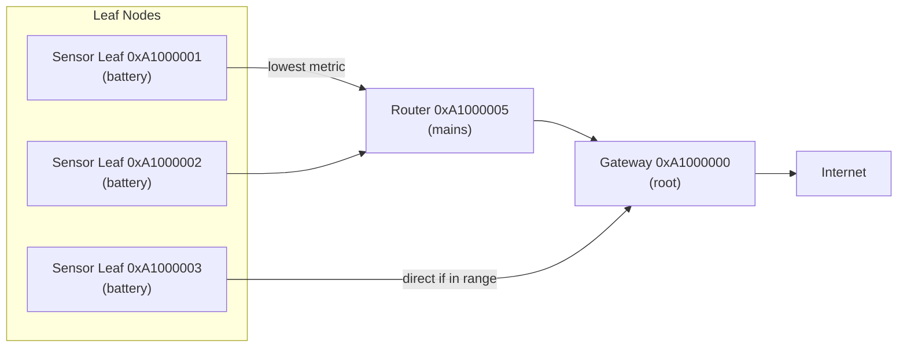
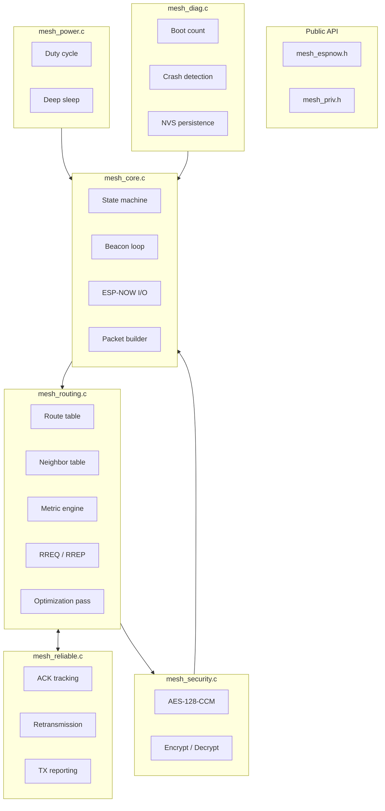

# ESP-NOW Mesh v3: A Self-Healing Wireless Network for ESP32

> No Wi-Fi. No router. No limits.

## Introduction

ESP-NOW Mesh v3 is a lightweight mesh networking library that turns ESP32 boards into a self-healing, multi-hop mesh using only ESP-NOW. No router, no IP stack, no ESP-MESH complexity.

It's designed for deployments where Wi-Fi infrastructure doesn't exist — sensor arrays in agricultural fields, underwater cave monitoring, warehouse asset tracking, or any scenario where you need hundreds of battery-powered nodes talking to each other for years.



## Why Build Another Mesh?

Existing solutions fall short:

| Solution | Problem |
|----------|---------|
| **ESP-MESH** | Proprietary, complex, relies on Wi-Fi AP/STA which increases power |
| **Thread/Matter** | Heavy stack, expensive certification, overkill for sensor data |
| **LoRa mesh** | Low bandwidth, long latency, not real-time capable |
| **BLE mesh** | Unreliable flooding, poor scalability past 50 nodes |
| **Custom ESP-NOW** | Point-to-point only, you build the routing yourself |

This library fills the gap: **ESP-NOW at the radio layer, intelligent routing on top**. You get the low power of ESP-NOW with the scalability of a real mesh.

## Features

| Feature | What it means |
|---------|--------------|
| Intelligent routing | Composite metric: hop count + RSSI + battery + capabilities + reliability |
| Multi-path | Primary + backup routes per destination; auto-promoted on failure |
| Self-healing | Neighbor lost → backup promoted in <2s; no network flood |
| Battery-aware | Prefers mains routers over battery leaves; announced in every beacon |
| Encrypted | AES-128-CCM every packet, 8-byte MIC |
| Reliable | ACK + exponential-backoff retransmission per hop |
| 1000+ nodes | Linear scaling with memory; fixed-size tables |
| Deep sleep | ~14µA idle — years on a coin cell |
| Multi-hop | Up to 32 hops via store-and-forward at each hop |
| Health monitoring | Boot count, crash detection via RTC, NVS persistence |
| No Wi-Fi needed | ESP-NOW only — no router, no IP, no ESP-MESH dependency |

## Architecture

The library is split into focused modules:



### Routing Metric

The composite metric decides the best path. Lower is better:

```plain
metric = (hop_count * 100)
       + (255 - rssi_dbm)
       + (battery_penalty)
       + (capability_bonus)
       + (reliability_penalty)
```

Where:
- **battery_penalty**: 0 for mains-powered, 50 for battery nodes
- **capability_bonus**: -20 for routers (preferred), 0 for leaves
- **reliability_penalty**: 0–100 based on recent ACK success rate

This ensures traffic flows through stable, mains-powered routers whenever possible.

## Getting Started

### ESP-IDF

```bash
git clone https://github.com/btechioi/mesh-espnow.git
cd mesh-espnow/examples/01_sensor_node
idf.py set-target esp32c3
idf.py build flash monitor
```

### Arduino IDE

1. Copy `mesh_espnow/` → `~/Arduino/libraries/`
2. **File → Examples → ESP-NOW Mesh Network Library → 01_sensor_node**
3. Select board, click Upload

```cpp
#include "mesh_espnow.h"

void setup() {
    mesh_espnow_config_t cfg = MESH_ESPNOW_CONFIG_DEFAULT();
    cfg.channel = 6;
    ESP_ERROR_CHECK(mesh_espnow_init(&cfg));
    ESP_ERROR_CHECK(mesh_espnow_start());
}

void loop() {
    mesh_espnow_process(millis());
    delay(100);
}
```

## Packet Flow

When a leaf node sends data to the gateway:

1. **Application** calls `mesh_espnow_send(gateway_id, data, len)`
2. **Core** looks up the route table for the next hop
3. **Security** encrypts payload with AES-128-CCM
4. **ESP-NOW** transmits the encrypted packet to the next hop
5. **Router** receives, decrypts header, looks up its own route table
6. **Router** re-encrypts and forwards to next hop
7. **Gateway** receives final packet, decrypts, delivers to application
8. **ACK** is sent hop-by-hop; source gets end-to-end delivery confirmation

Each hop adds less than 2ms of latency. A 10-hop path completes in under 20ms.

## Security

- AES-128-CCM authenticated encryption on every DATA and BROADCAST packet
- 8-byte MIC appended to each ciphertext
- 16-byte pre-shared key — change the default in production
- Headers stay in plaintext (needed for forwarding)

| Protected | Not protected |
|-----------|--------------|
| Application payloads | Packet header (src, dest) |
| Broadcast content | Beacon fields (caps, battery) |
| ACK payload | Node existence on network |

## Power Modes

| Mode | Avg Current | 250mAh Life | 3400mAh Life |
|------|-------------|-------------|-------------|
| ALWAYS_ON | ~15 mA | 17 hours | 9 days |
| DUTY_CYCLE | ~130 µA | 80 days | 3 years |
| DEEP_SLEEP (30s) | ~26 µA | 400 days | 15 years |
| DEEP_SLEEP (60s) | ~14 µA | 2 years | 28 years |
| ON_DEMAND | ~5 µA | 5.7 years | 78 years |

The `ON_DEMAND` mode is ideal for sensor nodes that wake on external events (e.g., door sensor, motion trigger) — they use virtually no power until something happens.

## Practical Applications

### Agricultural Sensor Network

Deploy 200 soil moisture sensors across a 50-acre field. Nodes deep-sleep most of the time, wake every 30 minutes to report, and route through mains-powered relay nodes at the field edges. Gateway at the farmhouse pushes data to the cloud. Battery life: 2+ years on AA cells.

### Warehouse Asset Tracking

Ping tags on pallets form a mesh. Any tag can reach any other. A few USB-powered anchor nodes near the ceiling provide gateway connectivity. System self-heals when pallets are moved and routes change.

### Cave / Tunnel Monitoring

No cellular, no Wi-Fi. Drop ESP32 nodes as you go deeper. Each node extends the network. Surface gateway relays data to the internet. If a node fails, traffic reroutes automatically.

## Project Status

The library is actively maintained on GitHub:

- **Source**: [github.com/btechioi/mesh-espnow](https://github.com/btechioi/mesh-espnow)
- **Issues & feature requests**: GitHub Issues
- **Releases**: [github.com/btechioi/mesh-espnow/releases](https://github.com/btechioi/mesh-espnow/releases)
- **License**: MIT

It also serves as the wireless transport layer for the [DroneFirmware](https://github.com/btechioi/DroneFirmware) project, providing reliable RC communication between transmitter and receiver.

## Summary

ESP-NOW Mesh v3 brings true mesh networking to ESP32 without the overhead of IP stacks, Wi-Fi infrastructure, or proprietary protocols. It's designed for real deployments: battery-aware routing, sub-2s self-healing, AES encryption, and years of battery life. If you need hundreds of wireless nodes talking to each other in the field, this library gives you a solid foundation.
